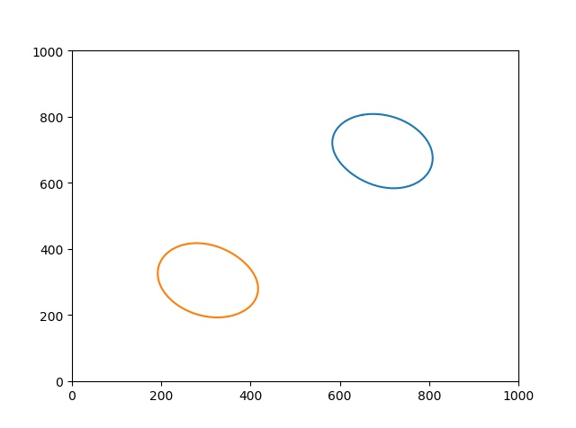
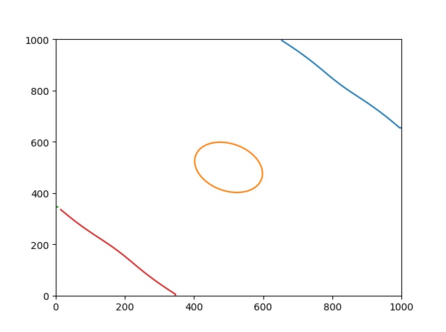

## 说明

- ### 实现反距离权重插值算法

  - #### 输入参数

    - ##### 离散点点集

    | x    | y    | z    |
    | ---- | ---- | ---- |
    | 0    | 0    | 0    |
    | 100  | 100  | 200  |
    | 300  | 300  | 500  |
    | 500  | 500  | 200  |
    | 700  | 700  | 500  |
    | 900  | 900  | 200  |
    | 1000 | 1000 | 0    |

    - ##### 像元大小。像元大小决定网格规模（行列数），本示例默认值为10，插值网格规模为100×100。

    - ##### 实现原理：遍历网格，依次计算估计值。详见IDW算法。

    - ##### 实现结果示例：生成矩阵，保存至二维数组，并进行可视化。

      https://github.com/kanvina/GIS_about/raw/master/img/pic_IDW.png

      

- #### 实现等值线提取算法

  - #### 输出：

    - 结果输出为拐点坐标集合数组。
  
  - #### 结果示例：
  
    以下分别为250m等值线与400m等值线的等值线可视化结果。若需要生成多条等值线，添加循环，递增目标值（已作为参数存放于接口中，可修改），多次执行方法即可。

- 